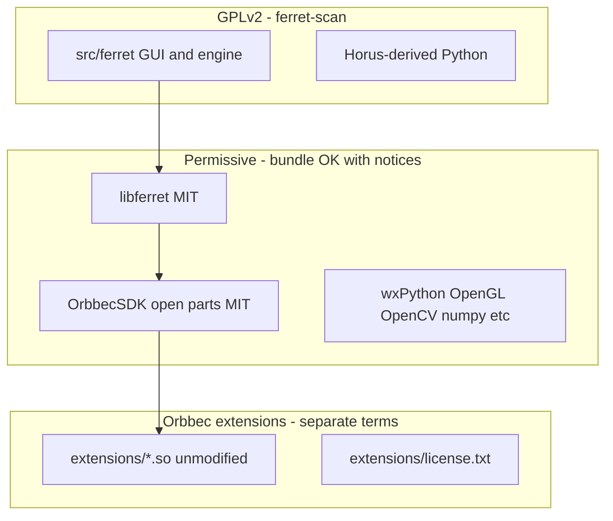

# License compliance plan for ferret-scan

## License landscape (what we are complying with)

| Component | License | Compliance rule |
|-----------|---------|-----------------|
| [LICENSE](LICENSE) / `src/ferret/*` | GPLv2 | Ship source (or offer) with any binary distribution; keep headers |
| [libferret/](libferret/) | MIT | Preserve copyright notices in THIRD_PARTY doc |
| `libOrbbecSDK.so` + MIT SDK sources | MIT | Same; document in THIRD_PARTY |
| `extensions/*.so` | [extensions/license.txt](libferret/OrbbecSDK_v2/extensions/license.txt) | **Unmodified** binaries only; include license text in packages; no patching/decompilation |
| `src/ferret/engine/driver/uvc/mac/` | CC BY-NC-SA (Pupil) | Document; avoid macOS binary releases if NC is a concern (low priority for Linux-only hobby use) |

**Out of scope:** commercial distribution, Creality algo blobs (removed entirely for now).

**Creality algo:** Not part of this compliance work. [doc/CREALITY_ALGO_ASSETS.md](doc/CREALITY_ALGO_ASSETS.md) may remain as **research notes only** (no fetch scripts, no build hooks, no runtime loader). Revisit only if a correct v2 integration is designed later.

---

## 1. Add a single source of truth for third-party licenses

Create **[doc/THIRD_PARTY_LICENSES.md](doc/THIRD_PARTY_LICENSES.md)** that lists:

- **Ferret Scan** — GPLv2, link to [LICENSE](LICENSE)
- **Horus / Gryphon Scan** — lineage and GPLv2 inheritance
- **libferret** — MIT ([libferret/pyproject.toml](libferret/pyproject.toml))
- **OrbbecSDK** — MIT ([libferret/OrbbecSDK_v2/LICENSE.txt](libferret/OrbbecSDK_v2/LICENSE.txt))
- **Orbbec extension libraries** — summarize [extensions/license.txt](libferret/OrbbecSDK_v2/extensions/license.txt): permitted use/redistribution of **unmodified** binaries; prohibited modification/decompilation
- **Python stack** — wxPython, OpenCV, NumPy, SciPy, Matplotlib, pyorbbecsdk (point to upstream licenses)
- **macOS UVC (Pupil)** — CC BY-NC-SA, Linux releases unaffected

Expand [README.md](README.md) **License** section: link to THIRD_PARTY; state that releases bundle **unmodified Orbbec extension libraries** with their license text. Do **not** mention Creality algo as a runtime dependency.

---

## 2. Orbbec extension binaries — package correctly

**Rules:**

1. Only ship **unmodified** `.so` files from the official Orbbec SDK build output (`lib/extensions/`).
2. Include **`extensions/license.txt`** (and optionally `End User License Agreement.txt`) in every binary artifact.
3. Continue **not** patching extension binaries (policy in [libferret/README.md](libferret/README.md); open-source changes stay in MIT SDK code only).

**Code changes:**

| File | Change |
|------|--------|
| [scripts/docker/build-appimage.sh](scripts/docker/build-appimage.sh) | After copying `extensions/`, `install -D` license files to `AppDir/usr/share/doc/ferret-scan/orbbec/` (AppRun already omits `FERRET_ALGO_DIR`; already `rm -rf` `lib/ferret`) |
| [flatpak/org.ferret.FerretScan.yml](flatpak/org.ferret.FerretScan.yml) | Install same docs under `/app/share/doc/ferret-scan/orbbec/`; `rm -rf` any `ferret/` under `/app/lib/orbbec/` after SDK copy |
| [scripts/lib/common.sh](scripts/lib/common.sh) | Add `ferret_orbbec_license_dir()` helper (paths under libferret submodule) for packaging scripts |

---

## 3. Remove Creality algo pipeline entirely

No optional download, no `ferret_setup_algo.py`, no `FERRET_ALGO_DIR`, no `make algo-assets`.

### 3a. libferret (submodule) — delete or stop using

| Item | Action |
|------|--------|
| [libferret/Makefile](libferret/Makefile) | Remove `algo-assets` target, `clean-algo`, `FERRET_SHARE` / `FERRET_ALGO_SOURCE_DIR`; `sdk` depends only on cmake build |
| [libferret/OrbbecSDK_v2/extensions/CMakeLists.txt](libferret/OrbbecSDK_v2/extensions/CMakeLists.txt) | Remove entire `FERRET_ALGO_SOURCE_DIR` block (lines 30–40) |
| `libferret/scripts/fetch_creality_algo.sh` | **Delete** |
| `libferret/scripts/extract_algo_blobs.py` | **Delete** |
| `libferret/scripts/creality_scan_download.py` | **Delete** (only used by fetch) |
| `libferret/share/ferret/` | Remove from tree if present; keep gitignored patterns |
| [libferret/README.md](libferret/README.md) | Remove algo.obconfig / fetch rows from tables; drop “not wired” algo references |
| `FerretAlgoLoader` / algo in `FerretDevice` | Already removed per [doc/CREALITY_ALGO_ASSETS.md](doc/CREALITY_ALGO_ASSETS.md); confirm no remaining `.cpp` / `.hpp` references in submodule |

### 3b. ferret-scan

| Item | Action |
|------|--------|
| [scripts/dev-setup](scripts/dev-setup) | Build SDK without triggering Creality fetch (`make -C libferret sdk` after Makefile fix, or direct `cmake` without `-DFERRET_ALGO_SOURCE_DIR`) |
| [doc/CREALITY_ALGO_ASSETS.md](doc/CREALITY_ALGO_ASSETS.md) | Trim to research-only: what the blobs are, why loader was removed, **no** install/fetch instructions |
| [scripts/docker/build-appimage.sh](scripts/docker/build-appimage.sh) | Keep `rm -rf lib/ferret`; add Orbbec license install (section 2) |
| `.gitignore` | Ensure `share/ferret/`, `.cache/creality/`, `**/lib/ferret/`, `algo.obconfig` ignored |

### 3c. Not doing

- `scripts/ferret_setup_algo.py`
- Help / Welcome UI for Creality assets
- `FERRET_ALGO_DIR` in `common.sh` or AppRun

---

## 4. GPLv2 obligations (non-commercial / hobby distribution)

| Requirement | Action |
|-------------|--------|
| License text | Keep [LICENSE](LICENSE); reference in README |
| Corresponding source | GitHub repo is sufficient; “Source: …” in THIRD_PARTY doc |
| Modifications | ferret-scan + libferret source in repo; Orbbec extensions **binary-only, unmodified** |
| No proprietary blobs in releases | Creality algo not shipped or fetched by project tooling |

---

## 5. Verification checklist

Add **`scripts/check_licenses.sh`** (or extend [scripts/dev-check](scripts/dev-check)):

- [ ] `extensions/license.txt` present in AppImage/Flatpak doc dir and beside packaged `extensions/` if applicable
- [ ] No `algo.obconfig`, `algo_blobs/`, or `lib/ferret/` under `dist/`
- [ ] No `fetch_creality_algo.sh` / `extract_algo_blobs.py` in libferret
- [ ] `make -C libferret sdk` does not network-download Creality Scan
- [ ] `libOrbbecSDK.so` and extension `.so` present when SDK build includes upstream extension binaries

Manual: `./ferret` + camera smoke after `dev-setup` (no algo step).

---

## 6. Known edge cases (document only)

- **Orbbec extensions on Creality hardware:** Document in THIRD_PARTY; extension license text governs bundled `.so` use.
- **macOS UVC (CC BY-NC-SA):** Note in THIRD_PARTY.
- **RE for compatibility:** Document that changes stay in MIT SDK sources; extension binaries stay unmodified.

---

## Implementation order

1. **Remove Creality pipeline** (libferret Makefile, CMake, scripts, README) — unblocks clean `dev-setup` / CI.
2. **THIRD_PARTY doc + README** — policy and attribution.
3. **Packaging** — Orbbec license files in AppImage/Flatpak; flatpak `rm -rf ferret/`.
4. **check_licenses.sh** — prevent regressions.

No change to Orbbec extension binaries themselves; no relicensing of ferret-scan.
